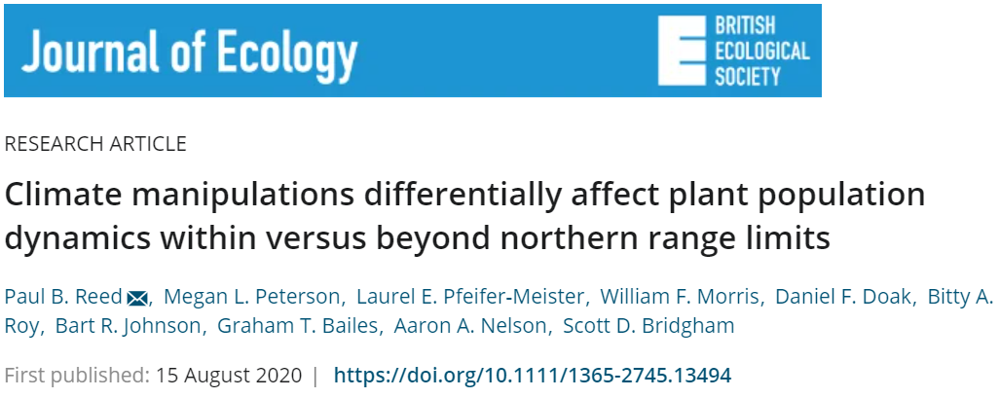

### Paper Summary
@Reed2020 examined the demographic consequences of warming and precipitation change on perennial forb species in the Pacific Northwest. They planted six species within different abiotic treatments (control, warming, increased precipitation, and both warmed and irrigated) within and beyond the species' ranges. While precipitation had no effect, changes in temperature decreased population growth rates of two species within current ranges, but not beyond current ranges, suggesting range movement is necessary for population persistance with climate change in the PNW.

### Journal Requirements
The Journal of Ecology does not have any specific requirements for open science besides [requiring data archiving](https://besjournals.onlinelibrary.wiley.com/hub/editorial-policies), but does not require code archiving. This journal is also piloting a [Transparent Peer Review](https://jecologyblog.com/2019/11/05/transparent-peer-review/) process.

### Checklist:

#### Questions to promote transparent reporting of methods and results:

1. Were all sample sizes fully reported, including exact values for all subsets of data (e.g., each treatment group), and for all statistical analyses? 

Yes, mostly in the supplementary materials.

2. Are the methods reported in sufficient detail to allow another researcher to gather the same
data and run the identical analyses? 

Yes, I think so.

##### Are statistical results reported completely (considered in two parts below)?

3. A) Are statistical results for each test reported in sufficient detail? What qualifies as ‘sufficient
detail’ will differ among analyses.

Yes, but mainly in supplementary materials.

3. B) Are results from all variables and from all models reported? Complete reporting should include
results related to all variables examined in preliminary models and all results from exploratory
analyses. 

Yes, but in supplementary materials. 

#### Questions to check biases of reviewers and authors:

4. Were observers kept unaware of the experimental treatment imposed on the samples (e.g.,
organisms, plots) when recording observations or measurements so as to minimize unconscious
bias? 

I don't think so! Not sure how one would figure this out, unless reported by the authors.

5. Did the authors explain how sample size was decided (e.g., based on a priori power analysis or
logistical constraints), or when an experiment with pre-set sample sizes was terminated? If
sample size or the end of the experiment was not decided prior to the initiation of the study, was
there a decision rule for when to cease data collection? 

I don't think they defend why they chose 200 seeds as their amount to sow, or why the project finished after three years (although 3 years - 2 yearly transitions - seems short for a demographic study, especially one looking at perennials). Any deviations were due to logistical constraints.

6. Did the authors develop their analysis plan, including choices of variables, without looking at the
data, for instance prior to gathering data or with a dummy data set? This is most easily
determined by the existence of a pre-registered analysis plan. In the absence of pre-registration,
a statement from the authors about the development of their analysis plan is still important.

As far as I can tell, they had an analysis plan before they collected the data. Although, after collecting data, they grouped 2 treatments together both because preliminary and previous analyses realized one variable (increased moisture) didnt have a strong effect. I buy their reasoning for this. 

7. How suitable do you find the research methods without considering the outcome? Evaluate the
design and methods regardless of whether or not there was a finding of “statistical significance”,
or whether or not the results conform to a predicted pattern.

I think their design (sowing seeds at three sites in factorial treatments and determining their effects with population models) is suitable and make sense for the questions they were asking.

8. Are the sample sizes large enough to justify the authors’ conclusions? If presenting significance
tests, how much power would this study have to detect statistically significant weak, moderate,
and strong effects? Expectation of effect size can best be derived from average effect sizes
presented in meta-analyses of similar topics. The effect size reported in the manuscript under
review can be a poor estimate of the underlying effect size, especially if the sample size is small,
which elevates sampling uncertainty. Statistical significance is a poor indicator of the reliability of
an estimate across a wide range of sample sizes and common effect sizes. 

That's a good question. They did have very low germination across most species at most sites, so I'm not sure if it was enough or not. They could have planted more seeds to begin with to have a bigger sample size. They also have very few populations establish - this definitly limits their conclusions. 

9. What does the size of the estimated effect (e.g., slope, correlation coefficient, difference in
means) suggest about its biological or practical importance, and what does uncertainty around
that effect estimate suggest about the estimate’s precision?

There are large 95% CI in many of the results, but since they did further tests to show significance, I dont think this is a problem. They also only had 2 species (of 6) that established at all three sites, which limits the importance of the results.

10. How unexpected would you judge these results to be in light of prior empirically derived
understanding? Effects that are more surprising in light of robust prior information are those that
had a lower prior probability of being correct. 

I don't think the results are unexpected. We know that species ranges will have to shift with novel environmental conditions, but we don't really understand the mechanisms behind it. Plants planted outside of their current range did better than in their current range isn't an unexpected result, and neither are the results that temperature treatments only negatively affected plants within their current ranges but not in novel ranges. 

### Bibliography
